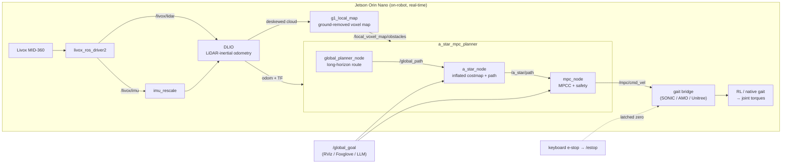

# Sim-to-Real Deployment of Learned Nonlinear MPC Navigation on a Bipedal Humanoid

### Bringing the robot-agnostic A\*+MPC framework onto real Unitree G1 hardware — DLIO perception, MPCC control, and RL-gait locomotion, all on a Jetson Orin Nano

**Authors:** Lorenzo Ortolani, Gabriel Voss, Gabriele Beltrami, Francesco Dorati, Tommaso Felice Banfi

**Affiliation:** Talos Robotics AI, Milan, Italy

[](https://relo02.github.io/Navigation/) [](https://docs.ros.org/en/humble/) [](https://www.unitree.com/g1/) [](https://www.nvidia.com/en-us/autonomous-machines/embedded-systems/jetson-orin/) [](https://github.com/talos-robotics-ai/Go2_navigation) [](https://www.gnu.org/licenses/gpl-3.0)

---

## Abstract

This repository is the **real-robot deployment layer** of the robot-agnostic
**A\*+MPC navigation framework** first introduced in
[Go2_navigation](https://github.com/talos-robotics-ai/Go2_navigation) (Unitree
Go2 quadruped, Gazebo) and extended to the Unitree G1 humanoid in Isaac Sim by
[G1_navigation](https://github.com/Relo02/G1_navigation). The
framework couples reactive rolling-horizon **A\*** planning on an inflated
occupancy grid with a **nonlinear Model Predictive Controller (CasADi/IPOPT)**,
and is *robot-agnostic*: the planner drives any platform by emitting body-frame
velocity commands that a locomotion layer tracks.

Here that identical planner is taken **onto the physical G1** and made to run
**entirely on-board a Jetson Orin Nano**. The contributions of this repo over the
simulation work are:

- **Real LiDAR-inertial perception** — a Livox **MID-360** feeds **DLIO**
  (Direct LiDAR-Inertial Odometry); a rolling, ground-removed, temporally-decaying
  **local voxel map** turns the raw scan into the obstacle cloud the planner
  consumes. No external motion capture, no pre-built map.
- **Time-optimal control** — the MPC runs as **MPCC** (Model Predictive
  Contouring Control): it maximises progress along the A\* path subject to the
  velocity limits and an obstacle barrier, reaching the goal in minimum time
  while staying collision-free.
- **Three interchangeable RL/where-native gaits** — the same `/mpc/cmd_vel`
  drives NVIDIA **SONIC**, the **AMO** RL gait (RoboJuDo), or the **Unitree
  native** high-level controller, selected at launch.
- **On-board real-time + safety engineering** — the whole stack (perception,
  planning, control, gait) runs on the Nano at real-time rates, with a layered
  **dynamic-obstacle safety** system: detect → track → **yield** to movers,
  **escape** static close-calls, a smooth in-NLP barrier, and hard stops on lost
  data. See [Safety & real-time](#safety--real-time-engineering).

Full architecture, per-node reference and tuning live in the
**[documentation site](https://relo02.github.io/Navigation/)** (or
[`docs/`](docs/README.md)).

---

## Relationship to the framework

| Layer | Go2_navigation | G1_navigation (sim) | **Navigation — this repo (real G1)** |
|---|---|---|---|
| Target | Go2 quadruped | G1 humanoid, Isaac Sim | **G1 humanoid, real hardware** |
| Compute | workstation | workstation + GPU | **on-board Jetson Orin Nano** |
| Localization | Gazebo / SDK odometry | USD OmniGraph + WS bridge | **DLIO LiDAR-inertial odometry** |
| Obstacle source | Unitree L1 LiDAR | MID-360 (sim) → filter | **MID-360 → `g1_local_map` voxel map** |
| Locomotion | CHAMP / Sport-API | AMO RL gait (sim) | **SONIC / AMO / Unitree native** |
| Controller | Nonlinear MPC | Nonlinear MPC | **MPCC (time-optimal) or tracking MPC** |
| Planner / MPC | `a_star_mpc_planner` | identical | **identical** `a_star_mpc_planner` |

The planner and its BO-tuned cost structure are carried over **without
algorithmic change** — only the *producer* of robot state (DLIO) and the
*consumer* of velocity (the gait) differ. That is the robot-agnostic claim, tested
one embodiment and one deployment target further: onto real bipedal hardware and
onto embedded compute.

---

## Repository structure

```
Navigation/
├── ros2_ws/                         # ROS 2 Humble workspace (built on the Jetson / in the localization image)
│   ├── autonomy.sh                  # on-robot orchestrator: DLIO + local map + planner + gait, with keyboard e-stop
│   └── src/
│       ├── direct_lidar_inertial_odometry   # DLIO (UCLA VECTR) LiDAR-inertial odometry
│       ├── livox_ros_driver2                # Livox MID-360 ROS 2 driver (tuned config)
│       ├── g1_local_map                     # rolling ground-removed voxel/obstacle map → planner
│       ├── a_star_mpc_planner               # A* + nonlinear MPC/MPCC (CasADi/IPOPT) — emits /mpc/cmd_vel
│       ├── g1_sim_bridge                    # IMU rescale, cmd_vel→gait bridges (SONIC/AMO/Unitree), e-stop
│       ├── g1_bringup                       # real_localization + planner launches, RViz
│       └── g1_description                   # G1 URDF / robot model
├── amo/                             # AMO RL-gait inference + joint-smoothing (RoboJuDo)
├── docker/                          # the three deployment images (unitree · localization · amo_policy)
├── sim/                             # Isaac Sim front-end (scene, MID-360 config, stabilizer) — see sim/README.md
├── policy/RoboJuDo -> ../../RoboJuDo    # symlink to the RoboJuDo deploy framework
├── scripts/ · setup_jetson.sh       # Jetson provisioning + helpers
└── docs/                            # documentation, grouped by macro-topic (rendered to GitHub Pages)
    ├── perception/  planning/  locomotion/  autonomy/  system/
    └── README.md                    # documentation index
```

A complete per-package / per-node reference lives in
[`docs/system/system_architecture.md`](docs/system/system_architecture.md); the
grouped index is [`docs/README.md`](docs/README.md).

---

## System architecture



Everything above runs **on the Nano**. The goal can come from an RViz/Foxglove
panel or from the higher-level **[agentic LLM navigation](docs/autonomy/AGENTIC_LLM_NAV.md)**
layer, which turns a natural-language instruction into `/global_goal`.

---

## Installation

### Prerequisites
- **Unitree G1** with a **Livox MID-360**, and a **Jetson Orin Nano** (JetPack /
  Ubuntu 22.04) as the on-board computer.
- **ROS 2 Humble** with **CasADi + IPOPT** (the MPC NLP), **PCL / Eigen /
  OpenMP** and **Livox-SDK2** (DLIO). These are baked into the `localization`
  Docker image and provisioned bare-metal by `setup_jetson.sh`.
- **Python ≥ 3.10** (planner, local map), **≥ 3.11** for the AMO gait (`torch`,
  `mujoco`, Unitree DDS bindings — provided by the `amo_policy` image).

### 1. Clone
```bash
git clone https://github.com/Relo02/Navigation.git
cd Navigation
git submodule update --init --recursive     # pulls policy/RoboJuDo
```

### 2. Build the workspace
On the **Jetson** (bare metal) or inside the **localization** container:
```bash
# Jetson (native) — see docs/system/BUILDING.md for the LIVOX_SDK2_ROOT rule
cd ros2_ws
export LIVOX_SDK2_ROOT=/opt/navigation
colcon build --symlink-install \
    --cmake-args -DROS_EDITION=ROS2 -DLIVOX_SDK2_ROOT=/opt/navigation
source install/setup.bash

# or in the container
cd docker && docker compose run --rm localization bash -lc "build_ws"
```
Most subsequent Python edits need **no rebuild** (`--symlink-install`) — see
[`docs/system/BUILDING.md`](docs/system/BUILDING.md).

### 3. (Optional) Docker images
```bash
cd docker
UNITREE_NET_IFACE=enp12s0 docker compose up localization   # DLIO + local map + planner
UNITREE_NET_IFACE=enp12s0 docker compose up unitree        # robot bridge + teleop + RViz
```
See [`docs/system/dockerfiles.md`](docs/system/dockerfiles.md) for the three-image
framework.

---

## Quick start

### Real robot — one orchestrator
Hold the robot **still ~3 s** at startup for DLIO's gravity init.

```bash
# Default gait is AMO; pick the gait consuming /mpc/cmd_vel with GAIT=
GAIT=sonic ros2_ws/autonomy.sh        # DLIO + local map + A*+MPC + SONIC bridge
GAIT=amo   ros2_ws/autonomy.sh        # ... + AMO WS bridge   (start the AMO policy too)
GAIT=unitree ros2_ws/autonomy.sh      # ... + Unitree native-gait bridge
```

`autonomy.sh` launches DLIO + `g1_local_map` (`real_localization.launch.py`), then
after `PLANNER_DELAY` the planner + the selected gait bridge
(`planner.launch.py gait:=$GAIT`), logs each stack to its own file under
`ros2_ws/logs/`, and keeps the terminal interactive as a **soft e-stop**:

| key | effect |
|---|---|
| `s` + Enter | **STOP** — latched `/estop`, gait gets zero velocity, robot holds |
| `g` + Enter | **GO** — release the e-stop, navigation resumes |
| `q` + Enter | quit (engages e-stop, then tears everything down) |

Then **send a goal** with RViz's *2D Goal Pose* (publishes `/global_goal`), or:
```bash
ros2 topic pub --once /global_goal geometry_msgs/PoseStamped \
  '{header: {frame_id: "odom"}, pose: {position: {x: 2.0, y: 0.0, z: 0.0}}}'
```

Gait-specific bring-up (SONIC controller start order, AMO policy container,
Unitree native mode) is in
[`docs/locomotion/`](docs/locomotion/SONIC_REAL_BRINGUP.md).

### Simulation (Isaac Sim)
A GPU front-end that publishes the same `/livox/lidar`, `/joint_states`, IMU and
pose the real robot does, so the identical ROS 2 stack runs unchanged:
```bash
sim/launch_g1_sim.sh          # Isaac Sim scene + MID-360 + AMO stabilizer
```
See [`sim/README.md`](sim/README.md) and
[`docs/system/simulation_stack.md`](docs/system/simulation_stack.md).

---

## Multimodal perception

The planner is **modality-agnostic**: `a_star_node` / `mpc_node` read obstacles
from a single configurable `PointCloud2` (`obstacle_topic`), so the perception
backend can change without touching the planner.

| Obstacle source | How |
|---|---|
| **DLIO local voxel map** (default) | `/local_voxel_map/obstacles` — rolling, ground-removed, decaying cloud from the MID-360 |
| **DLIO global keyframe map** | `enable_dlio_map:=true` — static context, floor-stripped (off by default) |
| **Global-planner confirmed cells** | `global_fusion_mode:=auto` — long-horizon wall memory, drift-tolerant, quality-gated |
| **2-D OccupancyGrid** | `enable_slam_map:=true` — a `slam_toolbox`/Nav2 map fused as static layer |
| **External ESDF costmap** | `costmap_backend:=external_grid` — plan on a pre-computed grid (e.g. nvblox) |

Perception details:
[`docs/perception/LOCAL_VOXEL_MAP.md`](docs/perception/LOCAL_VOXEL_MAP.md),
[`docs/perception/GROUND_SEGMENTATION.md`](docs/perception/GROUND_SEGMENTATION.md),
[`docs/perception/DLIO_G1_MID360_TUNING.md`](docs/perception/DLIO_G1_MID360_TUNING.md).

---

## Safety & real-time engineering

Because the whole stack runs on-board a Nano *and* around people, this repo adds a
layered safety system on top of the planner (all on the robot, no network in the
loop):

- **Dynamic-obstacle YIELD** — obstacles are clustered and velocity-tracked; a
  **confirmed mover** entering the robot's forward corridor makes it **stop and
  wait** until clear (a person routes around a stationary robot; a swerve could
  step into their path).
- **SECURITY escape** — a static obstacle too close triggers a debounced escape
  away from it.
- **In-NLP barrier** — everything else is avoided smoothly inside the MPCC cost.
- **Fail-safe stops** — stale pose/path, or a lost obstacle feed, hard-stop the
  robot rather than let it coast or walk blind; a bridge cmd_vel watchdog and a
  latched `/estop` sit underneath as defence in depth.

Full behaviour, priority ladder and mermaid diagrams:
**[`docs/planning/DYNAMIC_OBSTACLE_AVOIDANCE.md`](docs/planning/DYNAMIC_OBSTACLE_AVOIDANCE.md)**.

**Real-time optimization for the Nano** (measured, benchmarked): the perception
and MPC hot paths were vectorised to fit embedded compute — the voxel accumulator
**29.8 → 2.4 ms/scan**, obstacle clustering **4.4 → 0.3 ms**, and control-grade
IPOPT termination cutting MPCC solve time **p50 32 → 23 ms** at 100 % solve
success, with no CUDA rewrite. Method and numbers:
[`docs/planning/DISTRIBUTED_NAV_PLAN.md`](docs/planning/DISTRIBUTED_NAV_PLAN.md) §9.

---

## Component overview

| Package | Description |
|---|---|
| [`a_star_mpc_planner/`](ros2_ws/src/a_star_mpc_planner/) | Rolling-horizon A\* on an inflated grid + nonlinear **MPC/MPCC** (CasADi/IPOPT). Emits `/mpc/cmd_vel`. Global planner for long-horizon routes. **Identical planner to the Go2/G1 framework.** |
| [`g1_local_map/`](ros2_ws/src/g1_local_map/) | Rolling ground-removed voxel map: DLIO deskewed cloud → `/local_voxel_map/obstacles`. |
| [`direct_lidar_inertial_odometry/`](ros2_ws/src/direct_lidar_inertial_odometry/) | DLIO (UCLA VECTR) LiDAR-inertial odometry for the MID-360. |
| [`livox_ros_driver2/`](ros2_ws/src/livox_ros_driver2/) | Livox MID-360 ROS 2 driver (tuned config). |
| [`g1_sim_bridge/`](ros2_ws/src/g1_sim_bridge/) | IMU rescale, the three `cmd_vel`→gait bridges (SONIC ZMQ / AMO WebSocket / Unitree DDS), keyboard e-stop. |
| [`g1_bringup/`](ros2_ws/src/g1_bringup/) | `real_localization.launch.py`, planner launch, RViz. |
| [`g1_description/`](ros2_ws/src/g1_description/) | G1 URDF / meshes / RViz configs. |
| [`amo/`](amo/) | AMO RL-gait inference + joint-smoothing (RoboJuDo). |

---

## Roadmap

1. **Quantitative sim-to-real report** — reproduce the framework's evaluation
   harness on the real G1 and publish success / efficiency / solve-time tables
   against the Go2 and sim-G1 baselines.
2. **VLA / agentic navigation** — the [agentic LLM layer](docs/autonomy/AGENTIC_LLM_NAV.md)
   turns natural-language instructions into `/global_goal`; extend toward Visual
   Language Action models with continual online learning.
3. **Global+local fusion at scale** — mature the drift-tolerant global-map fusion
   into full multi-room routing memory.
4. **Optional off-board planning** — a ZMQ split for dev-iteration speed / heavier
   planners, kept out of the reactive loop; see
   [`docs/planning/DISTRIBUTED_NAV_PLAN.md`](docs/planning/DISTRIBUTED_NAV_PLAN.md).

---

## Documentation

Rendered site: **https://relo02.github.io/Navigation/** · source:
[`docs/README.md`](docs/README.md) (grouped by macro-topic:
**perception · planning · locomotion · autonomy · system**).

---

## Citation

This repository deploys the framework introduced in:

```bibtex
@inproceedings{ortolani2026bopt_mpc,
  title     = {Bayesian Optimization for Learning Nonlinear MPC in Autonomous Agent Navigation},
  author    = {Ortolani, Lorenzo and Voss, Gabriel and Beltrami, Gabriele and Dorati, Francesco and Banfi, Tommaso Felice},
  booktitle = {Proceedings of the IEEE/ICRA International Conference},
  year      = {2026},
  organization = {Talos Robotics AI}
}
```

---

## Acknowledgements

- [CasADi](https://web.casadi.org/) + [IPOPT](https://coin-or.github.io/Ipopt/) — nonlinear MPC solver stack
- [DLIO](https://github.com/vectr-ucla/direct_lidar_inertial_odometry) — Direct LiDAR-Inertial Odometry (UCLA VECTR)
- [RoboJuDo](https://github.com/talos-robotics-ai/RoboJuDo) — AMO reinforcement-learning humanoid gait
- NVIDIA **SONIC** walking policy and [Isaac Sim / Isaac Lab](https://github.com/isaac-sim/IsaacLab)
- [Livox-SDK2](https://github.com/Livox-SDK/Livox-SDK2) — MID-360 driver

---

## License

Released under the [GNU General Public License v3.0](https://www.gnu.org/licenses/gpl-3.0),
consistent with the [Go2_navigation](https://github.com/talos-robotics-ai/Go2_navigation) framework.
