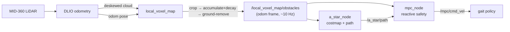
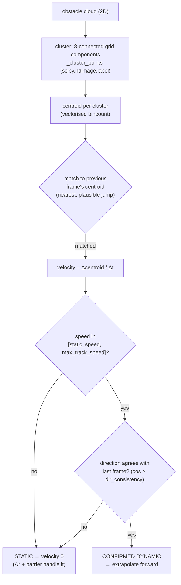
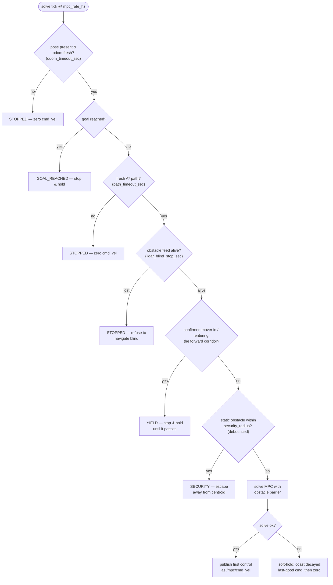
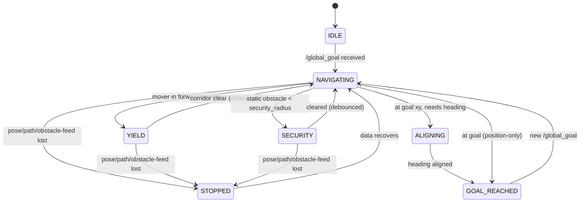
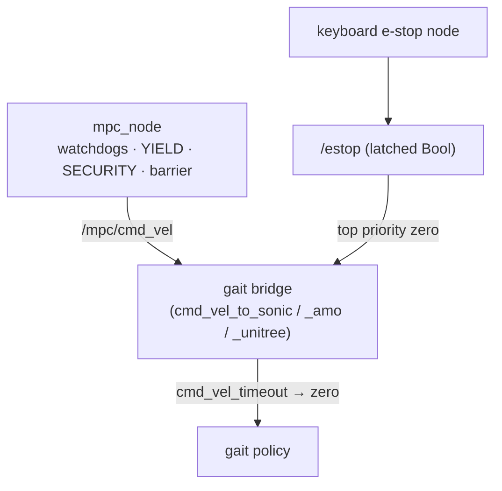

# Dynamic & static obstacle safety

How the navigation stack keeps the G1 safe around obstacles — **static** walls and
clutter, and **dynamic** movers (people, other robots) crossing its path. This
doc is the single reference for the safety behaviour that is spread across the
perception front-end and the MPC controller.

> **One-line summary:** obstacles are detected by the local voxel map, clustered
> and velocity-tracked in the MPC, and then handled by a **priority ladder** of
> reactions — hard stop on lost data, **YIELD** (stop and wait) for a mover
> crossing the path, a **SECURITY** sidestep for a static obstacle too close, and
> a smooth in-NLP **barrier** for everything else. When in doubt, the robot
> stops rather than guesses.

Code: [`a_star_mpc_planner/mpc_node.py`](../../ros2_ws/src/a_star_mpc_planner/a_star_mpc_planner/mpc_node.py)
(all safety logic), [`g1_local_map/local_voxel_map_node.py`](../../ros2_ws/src/g1_local_map/g1_local_map/local_voxel_map_node.py)
(obstacle source). Perception details: [../perception/LOCAL_VOXEL_MAP.md](../perception/LOCAL_VOXEL_MAP.md).
Controller internals: [MPCC_CONTOURING_MPC.md](MPCC_CONTOURING_MPC.md).

---

## 1. Where obstacles come from

The MPC never sees raw LiDAR. It consumes `/local_voxel_map/obstacles` — a
ground-removed, robot-centred, **temporally-decaying** obstacle cloud in the
world-fixed `odom` frame. Because it is in `odom`, a **static** obstacle keeps a
constant `(x, y)` no matter how the robot moves, which is what makes
velocity-tracking of *dynamic* obstacles possible (a static thing reads ~0
velocity; only a genuine mover reads non-zero).



Key property: the cloud **decays** (`persistence_s`, default 3 s), so a person
who walks through and leaves is forgotten within a few seconds instead of
smearing into a permanent phantom wall.

---

## 2. Detecting motion: cluster → track → confirm

Individual voxel points jitter frame-to-frame, so per-point velocity is
meaningless. Instead the MPC clusters the cloud into objects and tracks each
object's **centroid** across frames.



The **two gates** — a speed band *and* a temporal-consistency check — exist to
kill phantom motion. A static wall whose observed extent grows/shrinks as it
enters the field of view slides its centroid for a frame or two; that drift is
directionally incoherent, so it never confirms and the wall stays put. Only an
object moving coherently over consecutive frames is treated as dynamic.

Confirmed movers are displaced forward by `obs_predict_frac · N · dt` before
being handed to the controller, so the trajectory is optimised against where the
obstacle *will be*, not where it was. See `_cluster_points` and
`_predict_obs_positions` in `mpc_node.py`.

> These are also the velocities you see as magenta arrows on
> `/mpc/obstacle_velocities` in RViz — an arrow appears **only** for a confirmed
> mover, so it is a live readout of what the robot thinks is moving.

---

## 3. The safety priority ladder (every MPC solve, ~10 Hz)

`_solve_cb` runs the checks below **in order** and takes the first one that
fires. Higher = safer / more conservative. This ordering is deliberate: data
integrity beats reaction, stopping beats manoeuvring, and manoeuvring beats a
smooth barrier.



### 3.1 Fail-safe watchdogs (STOPPED)
No pose, stale odometry (`odom_timeout_sec`, 0.5 s), or no fresh A* path
(`path_timeout_sec`, 2 s) → explicit **zero** `cmd_vel`, never a silent return
that would let the robot coast on its last command.

### 3.2 Perception blind-stop (STOPPED)
Between `lidar_max_age_sec` and `lidar_blind_stop_sec` the MPC **holds the last
obstacle cloud** — in the `odom` frame the static structure it captured is still
valid, so this is strictly safer than the old behaviour of dropping all
obstacles. Past `lidar_blind_stop_sec` (2.5 s), or if no cloud ever arrived, the
robot **hard-stops**: it will not walk toward a goal with no obstacle data.

### 3.3 YIELD — the dynamic-obstacle behaviour (stop and wait)
A **confirmed-dynamic** cluster that is inside, or predicted within
`yield_lookahead_sec` to enter, the robot's **forward corridor** makes the robot
stop and hold until the mover has passed. Debounced both ways so a one-frame
blip neither trips nor clears it.

```
              corridor (body frame, rotates with yaw)
        ┌───────────────────────────────────────┐
   ─────┤  ← yield_corridor_halfwidth (±0.7 m)   │
   robot▶                                        │  ← yield_corridor_length (2.5 m)
   ─────┤                                        │
        └───────────────────────────────────────┘
   a person predicted to step into this box → YIELD (stop) until clear
```

**Why stop instead of swerve for a person?** A sidestep computed against where
the person *is* could step directly into where they are *going*. Stopping is the
predictable, safe reaction — the person routes around a stationary robot the way
they would around any stationary object. This is why YIELD sits **above**
SECURITY in the ladder: anything confirmed to be moving is yielded to, not
escaped from. Logic: `_dynamic_cluster_in_corridor` (a pure, unit-tested
predicate) + the debounce in `_solve_cb`.

### 3.4 SECURITY — the static-obstacle close call (escape)
A **real obstacle point** within `mpc_security_radius` (0.45 m) for
`mpc_security_engage_cycles` consecutive solves engages an escape: the robot is
pushed directly **away** from the offending centroid, along a short escape path,
until `mpc_security_clear_cycles` clean solves pass. This is the last-resort
reaction for a static obstacle that got too close (e.g. the robot was routed into
a tight gap) — grid-free and debounced so a single spurious point cannot trip it.

### 3.5 Obstacle barrier — the smooth everyday avoidance (in the NLP)
For everything that does *not* trip YIELD or SECURITY, avoidance is handled
*inside* the MPC optimisation. The cost function adds, per horizon step and per
selected obstacle point, a **soft sigmoid** zone (rises ~0.4 m before the safety
radius `obs_r`, so the robot eases away early) plus a **quadratic penetration**
penalty (a hard push-out if it gets inside `obs_r`). Obstacle points are chosen
with **angular-sector coverage** (nearest point per sector around the robot) so
the barrier represents obstacles on every side, not just the single nearest
clump. See `_select_obs_points` and the barrier terms in
[MPCC_CONTOURING_MPC.md](MPCC_CONTOURING_MPC.md).

### 3.6 Soft-hold — surviving a transient solve miss
A single failed IPOPT solve coasts on a **decayed** copy of the last-good command
for `mpc_soft_hold_cycles` (≈0.3 s) before commanding zero, so an occasional
numerical miss on the heavy NLP does not produce a visible stop/go stutter. The
watchdogs and security/yield stops above are unaffected — this only smooths over
numerical blips, never genuine danger.

---

## 4. Navigation state machine

`/navigation/state` (a `std_msgs/String`) publishes the current mode every solve,
for supervisors, logging, and the RViz/Foxglove overlay.



`ALIGNING`/`GOAL_REACHED` are the arrival behaviour and only appear when
`require_goal_heading` is set; by default the robot stops on reaching the goal
position (see the planner config comments).

---

## 5. Defence in depth — layers below the MPC

The MPC is not the only guard. Two independent layers sit under it so a failure
in the planner cannot run the robot away:



- **Bridge cmd_vel watchdog** (`cmd_timeout_sec`, 0.5 s): if the MPC stops
  publishing for any reason, the bridge forwards **zero** to the gait — the robot
  stops rather than holding the last velocity.
- **Latched `/estop`**: a keyboard e-stop node publishes a latched `Bool`; the
  bridge honours it with top priority, independent of the planner. Keep it on the
  robot side so a network/planner fault never disables the stop.

---

## 6. Parameters

All in [`config/planner_params_default.yaml`](../../ros2_ws/src/a_star_mpc_planner/config/planner_params_default.yaml).

| Parameter | Default | Meaning |
|---|---|---|
| **Dynamic (YIELD)** | | |
| `yield_enable` | `true` | Enable the stop-and-wait behaviour for movers |
| `yield_corridor_length` | `2.5` m | How far ahead the corridor extends |
| `yield_corridor_halfwidth` | `0.7` m | Corridor lateral half-width |
| `yield_lookahead_sec` | `1.5` s | Extrapolate movers this far to catch crossers early |
| `yield_engage_cycles` | `2` | Debounce in (~0.2 s @ 10 Hz) |
| `yield_clear_cycles` | `8` | Debounce out (~0.8 s @ 10 Hz) |
| **Motion tracking** | | |
| `obs_cluster_cell` | `0.30` m | Grid cell for connected-component clustering |
| `obs_static_speed` | `0.15` m/s | Below this a cluster is static |
| `obs_max_track_speed` | `2.5` m/s | Reject implausible centroid matches above this |
| `obs_dir_consistency` | `0.5` | cos threshold for "really moving" (temporal gate) |
| `obs_predict_frac` | `0.20` | Fraction of horizon to extrapolate movers |
| **Perception blind-stop** | | |
| `lidar_max_age_sec` | `1.0` s | Beyond this, hold the last cloud |
| `lidar_blind_stop_sec` | `2.5` s | Beyond this, hard stop (0 disables) |
| **SECURITY (static close-call)** | | |
| `mpc_security_enable` | `true` | Enable the escape reaction |
| `mpc_security_radius` | `0.45` m | Engage when a real point is this close |
| `mpc_security_escape_radius` | `1.0` m | How far the escape target is pushed |
| `mpc_security_engage_cycles` | `3` | Debounce in |
| `mpc_security_clear_cycles` | `5` | Debounce out |
| **Barrier (in-NLP)** | | |
| `mpc_obs_r` | `0.60` m | Safety radius (base half-width + margin) |
| `mpc_obs_alpha` | `6.0` | Sigmoid sharpness (lower = earlier, softer) |
| `mpc_W_obs_sigmoid` | `80.0` | Barrier weight |
| `mpc_max_obs_constraints` | `14` | Obstacle points fed to the NLP (angular-spread) |
| **Watchdogs / soft-hold** | | |
| `odom_timeout_sec` | `0.5` s | Stale-pose hard stop |
| `path_timeout_sec` | `2.0` s | Stale-path hard stop |
| `mpc_soft_hold_cycles` | `3` | Coast cycles on a transient solve miss |

---

## 7. Tuning by symptom

| Symptom | Try |
|---|---|
| Robot yields to a **static** wall (freezes) | Motion tracking should classify it static; if it flickers dynamic, raise `obs_dir_consistency` or `obs_static_speed`. Confirm no arrow on `/mpc/obstacle_velocities`. |
| Robot doesn't stop for a person crossing | Widen `yield_corridor_halfwidth`/`length`, raise `yield_lookahead_sec`, or lower `yield_engage_cycles`. |
| Robot stops too eagerly / too long after a mover leaves | Lower `yield_clear_cycles` (clears sooner) or narrow the corridor. |
| Robot hard-stops mid-run citing lost feed | Check `/local_voxel_map/obstacles` is publishing at ~10 Hz; raise `lidar_blind_stop_sec` only if the feed is legitimately bursty. |
| SECURITY escape triggers on nothing | Raise `mpc_security_engage_cycles` or shrink `mpc_security_radius` (note the local map already drops self-hits < 0.4 m). |
| Robot clips corners / hugs walls | Raise `mpc_obs_r` or lower `mpc_obs_alpha` (earlier avoidance); also A* `inflation_radius`. |

---

## 8. Tests

- [`test/test_yield_corridor.py`](../../ros2_ws/src/a_star_mpc_planner/test/test_yield_corridor.py) —
  corridor geometry (ahead/behind/lateral, yaw rotation, crossing-mover
  prediction) and clustering-partition equivalence vs the original union-find.
- On-robot: set a goal, walk across the robot's path — `/navigation/state` should
  read `YIELD` while you cross and return to `NAVIGATING` ~0.8 s after you clear.
  Pull the obstacle feed (kill `local_voxel_map`) mid-run — it must go `STOPPED`.
