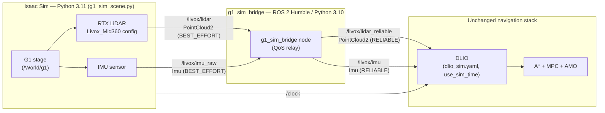

# Simulation stack — how the G1 navigation stack is wrapped into Isaac Sim

This document describes the **simulation front-end**: how NVIDIA **Isaac Sim**
stands in for the real Unitree G1 + Livox MID-360 so the *unchanged* **DLIO**
(`direct_lidar_inertial_odometry`) localization stack (and everything
downstream) runs against a simulated robot.

The guiding principle: **Isaac is wrapped to look exactly like the real sensor
front-end.** Everything above the LiDAR/IMU — DLIO, A\*, MPC, the AMO gait —
is identical in sim and on hardware. Only the *source* of
`/livox/lidar_reliable` + `/livox/imu` changes.

See also: [system_architecture.md](system_architecture.md) (the full closed
loop) and [dockerfiles.md](dockerfiles.md) (the deploy images). The sim code
lives in [`../sim/`](../sim/) and the bridge package in
[`../ros2_ws/src/g1_sim_bridge/`](../ros2_ws/src/g1_sim_bridge/).

---

## 1. Where sim plugs in

On the real robot, the Livox SDK driver produces the LiDAR + IMU messages
DLIO consumes. In simulation, **Isaac Sim + a thin bridge node** produce the
*same* messages on the *same* topics, in the *same* frame, at the *same* rate:



Why the bridge is still needed: Isaac publishes the cloud + IMU **BEST_EFFORT**,
but DLIO's subscribers are **RELIABLE**. The `g1_sim_bridge` node is a thin
**QoS relay** — it republishes `/livox/lidar` → `/livox/lidar_reliable` and
`/livox/imu_raw` → `/livox/imu`, upgrading only the QoS (no message conversion).
DLIO takes plain `PointCloud2` + `Imu` directly, so there is **no**
`/livox/custom_msg` and **no** Livox `CustomMsg` conversion anymore. The bridge
and Isaac talk over **CycloneDDS** (`RMW_IMPLEMENTATION=rmw_cyclonedds_cpp`).

---

## 2. How the robot + sensors are wrapped into Isaac

[`sim/g1_sim_scene.py`](../sim/g1_sim_scene.py) is a **standalone Isaac Sim
app** (launched through `isaac-sim/python.sh`, not the GUI selector). Wrapping
steps, in order:

1. **Boot the app** — `SimulationApp({"headless": ...})` starts a full Kit
   runtime (GUI by default). Everything below imports modules that only exist
   inside a running Kit app.
2. **Enable extensions** — `isaacsim.sensors.rtx` (ray-traced LiDAR),
   `isaacsim.sensors.physics` (IMU), `isaacsim.ros2.bridge` (ROS 2 publishing).
3. **Register the MID-360 profile** — the custom LiDAR config folder
   (`sim/lidar_configs/`) is appended to the carb setting
   `/app/sensors/nv/lidar/profileBaseFolder` so `config="Livox_Mid360"`
   resolves. (Isaac ships Velodyne/Ouster/Hesai/etc. but **no Livox** profile.)
4. **Open the G1 stage** — the saved USD with the G1 at `/World/g1` (lives in the
   `g1-isaac-sim` repo; path is configurable via `ISAAC_G1_STAGE` / `--usd`).
5. **Mount the sensors** — an RTX LiDAR and an IMU prim are created under
   `/World/g1/torso_link/mid360_link` (created as a fallback Xform if the stage
   lacks it). They are co-located, matching the real MID-360's built-in IMU.
6. **Wire ROS 2 publishing**:
   - **LiDAR** → a Replicator render product feeds the
     `RtxLidarROS2PublishPointCloud` writer → `/livox/lidar`
     (`sensor_msgs/PointCloud2`, frame `livox_frame`).
   - **IMU** → an **OmniGraph** action graph: `OnPlaybackTick → IsaacReadIMU →
     ROS2PublishImu` → `/livox/imu_raw`, plus `IsaacReadSimulationTime →
     ROS2PublishClock` → `/clock`.
7. **Play** — `SimulationContext.play()` and pump `simulation_app.update()`;
   the render product + physics step drive the publishers every frame.

### The MID-360 model

[`sim/gen_mid360_config.py`](../sim/gen_mid360_config.py) generates
`Livox_Mid360.json`, an RTX **rotary** multi-beam profile approximating the real
sensor: **360° horizontal × −7°…+52° vertical** FOV, 0.1–70 m range, 64 beams
spun at 10 Hz, ~200k pts/s.

> ⚠️ It is **geometry/FOV-faithful, not bit-exact** — a spun multi-beam, not the
> proprietary non-repetitive rosette. `rotary` was chosen because it reliably
> produces returns; a hand-authored `solidState` rosette emitted empty clouds
> (`width:0`). Verify with `ros2 topic echo /livox/lidar --field width --once`.

---

## 3. The bridge node — QoS relay between Isaac and DLIO

DLIO subscribes to a plain `sensor_msgs/PointCloud2` cloud and a
`sensor_msgs/Imu` with **RELIABLE** QoS. Isaac publishes both **BEST_EFFORT**,
which a RELIABLE subscriber will not match. The
[`g1_sim_bridge`](../ros2_ws/src/g1_sim_bridge/) node closes that gap, **in sim
only**, as a thin QoS relay (no message conversion):

| | Isaac output | Bridge output (→ DLIO) |
|---|---|---|
| Cloud | `/livox/lidar` PointCloud2, BEST_EFFORT | `/livox/lidar_reliable` PointCloud2, RELIABLE |
| IMU | `/livox/imu_raw` Imu, BEST_EFFORT | `/livox/imu` Imu, RELIABLE |

The relay only upgrades QoS — message contents are unchanged. There is no
`CustomMsg`, no `offset_time`/`line`/`tag` synthesis, and no `lidar_type`
switch: DLIO consumes `/livox/lidar_reliable` + `/livox/imu` directly. The
sim-specific tuning lives in `g1_sim_bridge/config/dlio_sim.yaml`, layered over
the vendored DLIO `cfg/dlio.yaml` + `cfg/params.yaml`.

---

## 4. Running it

```bash
# 1) Isaac Sim (publishes /livox/lidar, /livox/imu_raw, /clock)
cd Navigation/sim
./launch_g1_sim.sh                       # GUI; --headless to hide; ISAAC_SIM_PATH to relocate

# 2) bridge + DLIO (Humble shell, ros2_ws built with g1_sim_bridge)
ros2 launch g1_sim_bridge sim_localization.launch.py
#   bridge only (run DLIO yourself):
ros2 launch g1_sim_bridge sim_localization.launch.py start_dlio:=false
```

Both sides must share `RMW_IMPLEMENTATION=rmw_cyclonedds_cpp` and the same
`ROS_DOMAIN_ID`. The G1 is unactuated until you drive its joints — feed it the
locomotion/AMO policy the same way as on the robot; DLIO localizes off the
LiDAR + IMU regardless. DLIO needs the robot **stationary for the first ~3 s**
(IMU + gravity calibration). Full details: [`sim/README.md`](../sim/README.md).

---

## 5. Sim ↔ real parity

| | Real robot | Simulation |
|---|---|---|
| LiDAR cloud | `livox_ros_driver2` → `/livox/lidar` PointCloud2 | Isaac RTX LiDAR → `g1_sim_bridge` → `/livox/lidar_reliable` PointCloud2 |
| IMU | Livox driver → `/livox/imu` (RELIABLE) | Isaac IMU → `g1_sim_bridge` → `/livox/imu` (RELIABLE) |
| DLIO cloud topic / type | `/livox/lidar_reliable` PointCloud2 (RELIABLE) | identical |
| Frame | `livox_frame` | `livox_frame` |
| Rate | 10 Hz | 10 Hz |
| DLIO config | `dlio_mid360_real.yaml` | `dlio_sim.yaml`, `use_sim_time:=true` |
| Time | wall clock | Isaac `/clock` (`use_sim_time`) |
| `g1_sim_bridge` | **not used** (driver already RELIABLE) | required (QoS relay) |

Everything above the LiDAR/IMU layer — DLIO, A\*, MPC, AMO — is byte-for-byte
the same code path in both modes. That is the whole point of wrapping Isaac to
the driver's contract.
