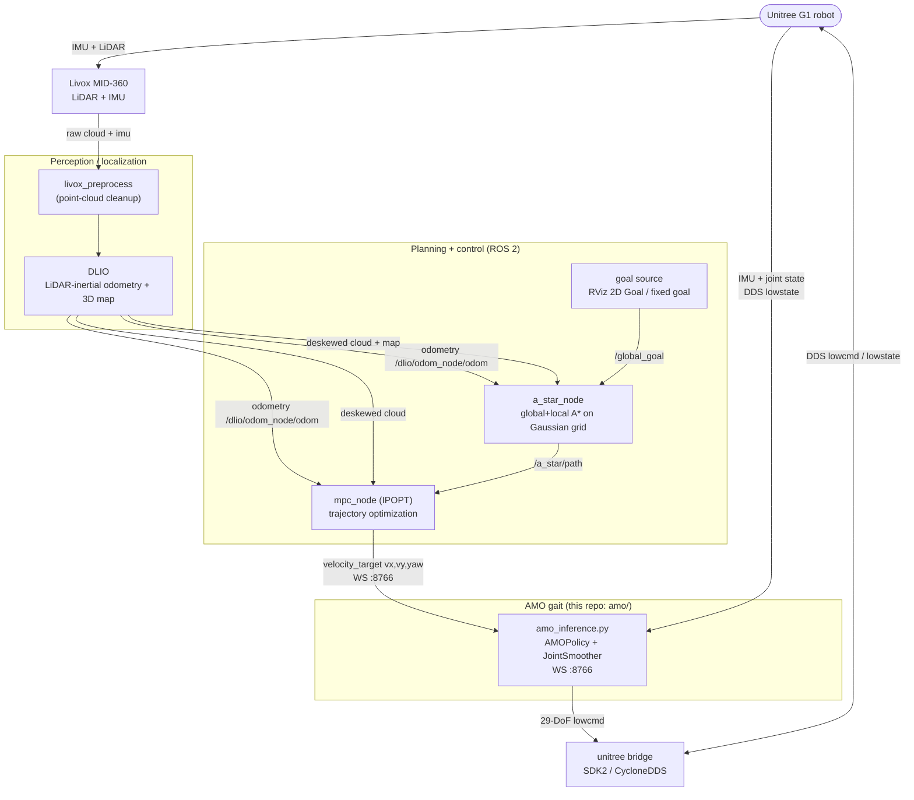
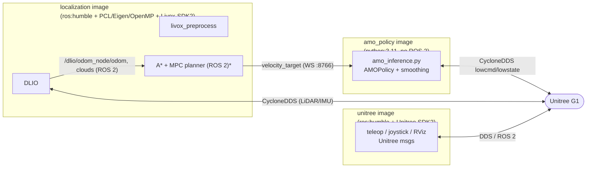
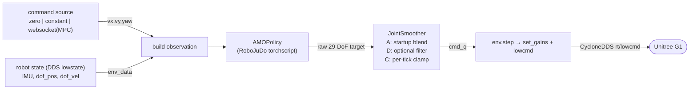

# System architecture

End-to-end overview of the Unitree G1 autonomous-navigation stack as packaged by
this `Navigation/` deployment layer:

**LiDAR + IMU → DLIO localization → A\* global/local planning → MPC
trajectory tracking → AMO RL walking gait → robot.**

The closed loop runs continuously: *pose + obstacles + goal → A\* path → MPC
velocity → AMO gait → robot moves → new pose*. The navigation layer thinks in
**goals and paths**; the AMO policy thinks only in **velocity commands**
`(vx, vy, yaw_rate)`. The MPC is the bridge between the two.

See also: [dockerfiles.md](dockerfiles.md) (the three images) and
[amo_inference_plan.md](amo_inference_plan.md) (the gait + smoothing internals).

---

## 1. Closed-loop data flow

The AMO policy is a **velocity-tracking** controller: it never sees the goal. It
receives `(vx, vy, yaw_rate)` from the MPC and produces stable walking that
realizes that velocity. All goal→path→velocity reasoning is upstream in A\*/MPC.

---

## 2. Mapping onto the deployment images

The three `Navigation/docker` images and where each component runs:

\* The A\*/MPC planner is a ROS 2 package (`a_star_mpc_planner`). It runs in the
ROS 2 environment — co-located with the `localization` image (or its own ROS 2
container). It is **not** a separate `Navigation/docker` image; only
perception, the AMO gait, and the Unitree bridge are packaged here.

| Concern | Image | Transport in | Transport out |
|---|---|---|---|
| Point-cloud cleanup + DLIO | `localization` | CycloneDDS (LiDAR/IMU) | ROS 2 topics |
| A\* + MPC planning | ROS 2 (with `localization`) | ROS 2 (`/dlio/odom_node/odom`, clouds, `/global_goal`) | **WebSocket `:8766`** |
| AMO gait + smoothing | `amo_policy` | WS `:8766` (velocity) + DDS (robot state) | CycloneDDS `rt/lowcmd` |
| Teleop / Unitree bridge / RViz | `unitree` | DDS / ROS 2 | DDS / ROS 2 |

Why the AMO policy is isolated: RoboJuDo needs Python 3.11 + a specific
torch/mujoco/cyclonedds stack that conflicts with the ROS 2 Humble (Python 3.10)
perception stack — so it talks to the rest of the system over the WS bridge and
raw DDS, never by sharing a Python environment. See [dockerfiles.md](dockerfiles.md).

---

## 3. AMO inference internals (the velocity → joints path)

Inside [amo/amo_inference.py](../amo/amo_inference.py), each 50 Hz tick:

- **Inputs:** (1) the velocity command `(vx, vy, yaw_rate)` from the command
  source, and (2) the robot's proprioceptive state (IMU orientation/angular
  velocity, joint positions/velocities) over DDS.
- **Command source** is selected by `command.source` in
  [docker/config/amo_g1.yaml](../docker/config/amo_g1.yaml):
  `websocket` = live references from the **MPC planner** (`:8766`); `constant` =
  hardcoded velocities (config or `--vx/--vy/--yaw`); `zero` = stand in place.
- **Smoothing** (`JointSmoother`) guarantees no joint snap at activation: an
  S-curve blend from the captured posture to the first AMO reference + a
  soft→full PD-gain ramp (startup only), plus a per-tick clamp always on, and an
  optional always-on slew filter. Details in [amo_inference_plan.md](amo_inference_plan.md).

---

## 4. Frames & key interfaces

| Interface | Type | Producer → Consumer | Payload |
|---|---|---|---|
| `rt/lowstate` | CycloneDDS | robot → AMO / DLIO | IMU, joint state |
| `rt/lowcmd` | CycloneDDS | AMO → robot | 29-DoF PD targets + gains |
| LiDAR/IMU | CycloneDDS | MID-360 → DLIO | point cloud + IMU |
| `/dlio/odom_node/odom`, TF `odom→base_link` | ROS 2 | DLIO → A\*/MPC | localization odometry |
| deskewed cloud, map | ROS 2 | DLIO → A\*/MPC | planning inputs |
| `/global_goal` | ROS 2 | RViz/goal → A\* | navigation goal |
| `/a_star/path` | ROS 2 | A\* → MPC | global/local path |
| `velocity_target` | WebSocket `:8766` | MPC → AMO | `vx, vy, yaw_rate` |

> Note on the MID-360: it is mounted inverted on the G1, so the IMU needs the
> extrinsic correction. On the real robot this is handled by DLIO's
> `baselink2imu` rotation extrinsic = `R_x(180)` in `dlio_mid360_real.yaml`
> (stock Livox driver) — see the project memory on the inverted IMU before
> trusting odometry while walking. In sim the IMU is upright, so `dlio_sim.yaml`
> uses identity extrinsics.

---

## 5. Bring-up order

1. **Robot + DDS** reachable on the chosen NIC (`UNITREE_NET_IFACE`).
2. **localization** — LiDAR preprocessing + DLIO → pose/odometry stable. Keep the
   robot **stationary for the first ~3 s** so DLIO can run its IMU + gravity
   calibration before it starts moving.
3. **planner** (A\* + MPC) — consumes pose + clouds + goal, emits `velocity_target`.
4. **amo_policy** — `./docker/run_amo.sh` (or `docker compose run amo_policy …`).
   Staged snap-free activation runs first; then it tracks `velocity_target`
   (`command.source: websocket`) or a configured/zero command.

Start the AMO gait with [../docker/run_amo.sh](../docker/run_amo.sh) — e.g.
`NET_IF=eth0 ./run_amo.sh --observe_only` for a dry run.
