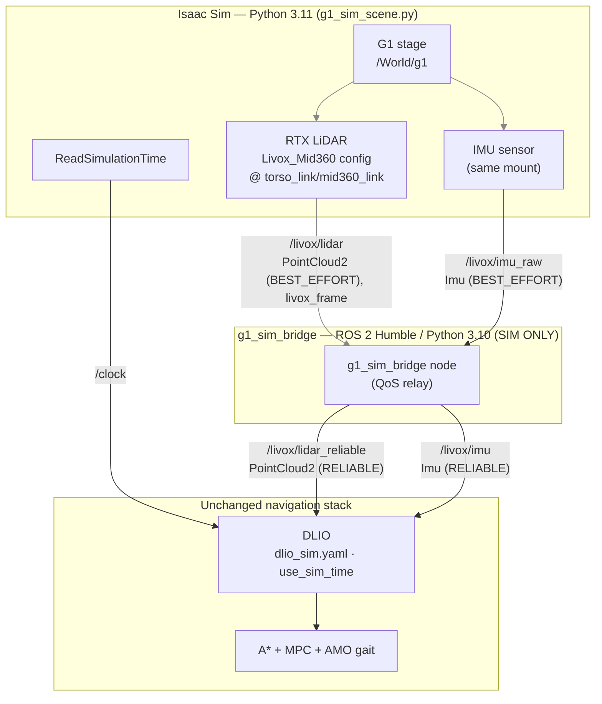
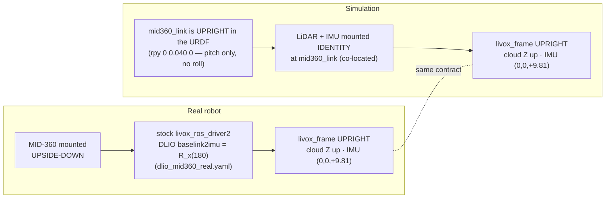

# G1 Isaac Sim — locomotion & localization testbed

Launches **Isaac Sim** with the Unitree **G1** plus a **Livox MID-360** LiDAR
and IMU, published to ROS 2 **exactly the way the real robot does**, so the same
**DLIO** (`direct_lidar_inertial_odometry`) stack runs unchanged against the
simulator.



> All Isaac→ROS 2 traffic is **CycloneDDS** (`RMW_IMPLEMENTATION=rmw_cyclonedds_cpp`),
> the same transport the rest of the stack uses.

The bridge is a thin **QoS relay**: Isaac publishes the cloud + IMU
**BEST_EFFORT**, but DLIO subscribes **RELIABLE**, so the node republishes
`/livox/lidar` → `/livox/lidar_reliable` and `/livox/imu_raw` → `/livox/imu`,
upgrading only the QoS (no message conversion). DLIO consumes plain
`PointCloud2` + `Imu` directly — there is **no** `/livox/custom_msg` and no
Livox `CustomMsg` anymore.

## Why a Livox MID-360 specifically

The config `lidar_configs/Livox_Mid360.json` models the real sensor's geometry:
360° horizontal × **−7°…+52°** vertical FOV, 0.1–70 m range, ~10 Hz, ~200k pts/s.
It's an RTX **rotary** multi-beam (64 beams spun 360°) — *not* the proprietary
non-repetitive rosette, but a same-FOV cloud DLIO consumes identically. The
`rotary` scan type is the well-tested Isaac path that reliably produces returns
(a hand-authored `solidState` rosette emitted empty clouds — `width:0`).
Generated by `gen_mid360_config.py` — see *Tuning*.

## Prerequisites

- Isaac Sim 5.1 at `/home/lorenzo/TalosRoboticsAI/g1/g1-isaac-sim/isaac-sim`
  (override with `ISAAC_SIM_PATH`). The G1 stage lives in that repo under
  `isaac_projects/` (default `g1_basic_world.usd`; override with
  `ISAAC_G1_STAGE` or `--usd`). The stage must contain the G1 with a
  `mid360_link` prim — if absent, the scene creates an upright Xform fallback.
- The Humble workspace at `Navigation/ros2_ws` built with `g1_sim_bridge`,
  `direct_lidar_inertial_odometry` (DLIO), and `livox_ros_driver2`.

## Run (simulation)

**1 — Isaac Sim** (publishes `/livox/lidar`, `/livox/imu_raw`, `/clock`):

```bash
cd Navigation/sim
./launch_g1_sim.sh                 # GUI
./launch_g1_sim.sh --headless      # no window
ROS_DOMAIN_ID=7 ./launch_g1_sim.sh # match your stack's domain
```

**2 — bridge + DLIO** (in a Humble-sourced shell with the ws built):

```bash
ros2 launch g1_sim_bridge sim_localization.launch.py
# bridge only (run DLIO yourself):
ros2 launch g1_sim_bridge sim_localization.launch.py start_dlio:=false
```

Both sides must share `RMW_IMPLEMENTATION=rmw_cyclonedds_cpp` and `ROS_DOMAIN_ID`.

**3 — walk.** The G1 in sim is unactuated until you drive its joints. Feed your
locomotion policy / companion the way you do on the robot; DLIO localizes
off the LiDAR+IMU regardless. Keep the robot **stationary for the first ~3 s**
so DLIO can finish its IMU + gravity calibration.

## Verifying topics reach the localization container

Isaac runs on the **host**; DLIO runs in the **`localization` container**.
They interoperate over DDS only when **all three** match: `rmw_cyclonedds_cpp`,
the same `ROS_DOMAIN_ID`, and ROS 2 **Humble** (the container is Humble; the
launcher forces Isaac to Humble too — a stray `/opt/ros/jazzy` in your shell
otherwise makes Isaac publish on Jazzy typesupport that Humble cannot read). The
container uses `network_mode: host` + default CycloneDDS, so discovery works over
loopback with no extra config.

```bash
# host: start Isaac (Humble + CycloneDDS + domain 0, all forced by the launcher)
Navigation/sim/launch_g1_sim.sh

# container: open a shell and run the bridge + the checker
cd Navigation/docker
docker compose run --rm localization bash
#   inside the container (sim/ is mounted at /sim, the ws at /ws):
source /opt/ros/humble/setup.bash && source /ws/install/setup.bash
ros2 launch g1_sim_bridge sim_localization.launch.py start_dlio:=false &  # produces /livox/lidar_reliable
bash /sim/verify_topics.sh
```

[`verify_topics.sh`](verify_topics.sh) lists topics and reports the rate of each
expected one — Isaac-raw (`/clock`, `/livox/lidar`, `/livox/imu_raw`) and
bridge-output (`/livox/lidar_reliable`, `/livox/imu`) — and checks the IMU Z.
Manual equivalents:

```bash
ros2 topic list
ros2 topic hz  /livox/lidar             # ~10 Hz
ros2 topic hz  /livox/lidar_reliable    # ~10 Hz (needs the bridge running)
ros2 topic echo /livox/imu_raw --once --field linear_acceleration   # z ≈ +9.81 at rest
```

If a topic is `NOT ADVERTISED` from inside the container: check `ROS_DOMAIN_ID`
matches Isaac, that both use `rmw_cyclonedds_cpp`, and that no `CYCLONEDDS_URI`
pins DDS to a NIC that excludes loopback.

## Tuning the MID-360

Density is `N_BEAMS` (vertical) × `reportRateBaseHz` (horizontal columns/s),
with `reportRateBaseHz = TARGET_POINTS_PER_SEC / N_BEAMS` (default 64 beams,
200 000 pts/s). After a run, check:

```bash
ros2 topic echo /livox/lidar --field width --once   # points per msg (must be > 0!)
ros2 topic hz /livox/lidar                            # ~10 Hz
```

Edit `N_BEAMS` / `TARGET_POINTS_PER_SEC` at the top of `gen_mid360_config.py`,
re-run it (the launcher also regenerates a missing config and symlinks it into
Isaac's config path), and relaunch.

> If `width:0` (empty clouds): the config didn't load or the scene has no
> RTX-hittable geometry. Isolate with a built-in profile —
> `./launch_g1_sim.sh --lidar-config Example_Rotary`; if points appear, it's the
> custom config; if still empty, the stage lacks geometry in range.

## How this matches the real robot

| | Real robot | Simulation |
|---|---|---|
| LiDAR cloud | `livox_ros_driver2` → `/livox/lidar` PointCloud2 | `g1_sim_bridge` → `/livox/lidar_reliable` (PointCloud2, RELIABLE) |
| IMU | Livox driver → `/livox/imu` (RELIABLE) | Isaac → `/livox/imu_raw` → bridge → `/livox/imu` (RELIABLE) |
| Frame | `livox_frame` | `livox_frame` |
| Rate | 10 Hz | 10 Hz |
| DLIO config | `dlio_mid360_real.yaml` | `dlio_sim.yaml`, `use_sim_time:=true` |

On the real robot `g1_sim_bridge` is **not** used — the Livox driver publishes a
RELIABLE cloud + `/livox/imu` that DLIO matches directly. See the real-deploy
notes below.

## Frame & Z-axis conventions (LiDAR + IMU)

DLIO (`dlio_sim.yaml`) assumes **identity** `baselink2imu` extrinsics and an
**upright** `livox_frame`: cloud Z up, and a right-side-up IMU reading
**accel ≈ (0, 0, +9.81) m/s²** at rest. The sim is built to land in exactly that
state.



Why this is correct:

- **The real robot's correction and the sim's mounting converge on the same
  upright frame.** On hardware the sensor is *physically* inverted; the stock
  Livox driver leaves the IMU inverted, and DLIO un-flips it with the
  `baselink2imu = R_x(180)` rotation extrinsic in `dlio_mid360_real.yaml`. In sim
  the sensor is *not* physically inverted — `mid360_link` is upright in the URDF
  (`rpy 0 0.0401 0`, a ~2.3° pitch, **no roll**) and we mount the LiDAR + IMU at
  identity, so the output is already upright. `dlio_sim.yaml` therefore uses
  **identity** extrinsics — no `R_x(180)` is applied (or needed) in sim.
- **LiDAR↔IMU stay consistent.** Both are children of the *same* `mid360_link`
  prim with the *same* orientation, so the identity `baselink2imu` extrinsic
  `dlio_sim.yaml` assumes holds exactly — and the sim **avoids the real robot's
  historical inverted-IMU bug** (cloud upright + IMU raw-inverted → divergence on
  motion).
- **IMU units & sign match.** Isaac `IsaacReadIMU` runs with `readGravity=True`,
  emitting **m/s²** specific force — at rest `(0, 0, +9.81)`, the same convention
  the real `/livox/imu` and the `odometry_debugger` expect (DLIO normalises
  the magnitude regardless).

**Verify on first run** (the one thing worth confirming, since a flipped IMU is
silent until the robot moves):

```bash
ros2 topic echo /livox/imu --once     # linear_acceleration.z should be ≈ +9.81 at rest
# ground returns should sit BELOW the sensor (z ≈ −1 m), ceiling above.
```

If your G1 USD ever mounts `mid360_link` inverted (Z down), reproduce the real
sensor's inversion with `./launch_g1_sim.sh --lidar-rpy-deg 180,0,0` instead of
editing the stack.

## Real-deploy stack — readiness

The Docker deploy (`Navigation/docker`, service `localization`) is unblocked:

- `Dockerfile.localization` notes:
  - `FROM osrf/ros:humble-desktop` (the `library/ros` repo has no `desktop` tag).
  - DLIO's build deps — PCL, Eigen, OpenMP (`libpcl-dev`, `libeigen3-dev`,
    `libomp-dev`, `ros-humble-pcl-ros`) — live in the base layer. Open3D 0.14.1
    and Livox-SDK1 were removed (they only served the old FAST-LIO / `open3d_loc`
    path). Livox-SDK2 is still built for the real-robot `livox_ros_driver2`.
  - `build_ws` no longer passes `-DOpen3D_DIR`.
- Real LiDAR: `g1_bringup real_localization.launch.py` starts `livox_ros_driver2`
  in `xfer_format=0` so it publishes `/livox/lidar` (PointCloud2 `PointXYZRTLT`,
  with per-point timestamps → DLIO auto-detects `SensorType::LIVOX`) + a raw
  `/livox/imu`, `frame_id=livox_frame`, `publish_freq=10` — the cloud + IMU DLIO
  consumes directly (no QoS relay needed on the real robot). The inverted-IMU
  mount is corrected by DLIO's `baselink2imu = R_x(180)` in `dlio_mid360_real.yaml`.

Build & run the real localization (per the top-level README):

```bash
cd Navigation/docker
docker compose build localization                 # image
docker compose run --rm localization bash
build_ws                                           # rosdep + colcon inside the container
ros2 launch g1_sim_bridge sim_localization.launch.py   # sim (Isaac + QoS relay + DLIO)
ros2 launch g1_bringup    real_localization.launch.py  # real robot (Livox driver + DLIO)
```

> This pass wired the files and ran static checks only; the heavy
> `docker compose build` / `colcon build` were **not** executed here — run the
> commands above to produce the binaries.
